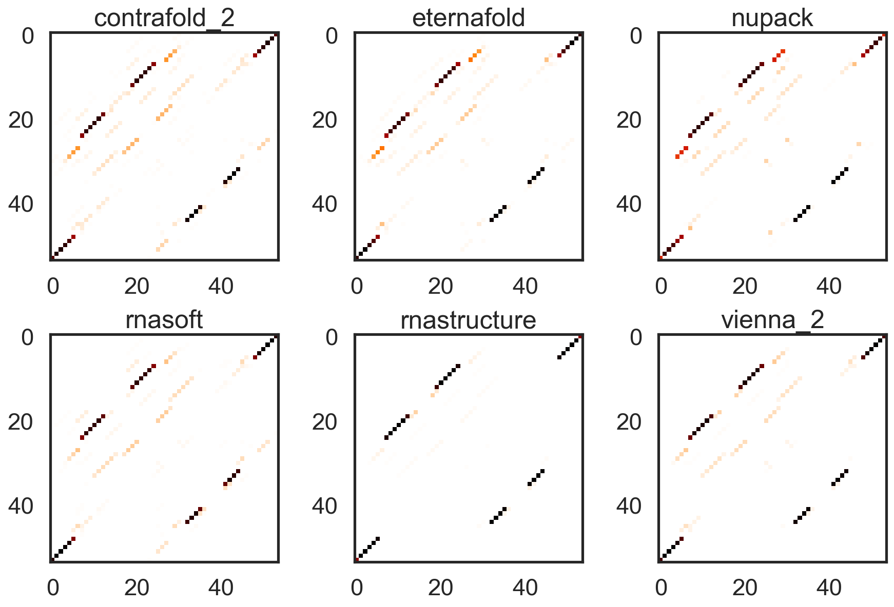
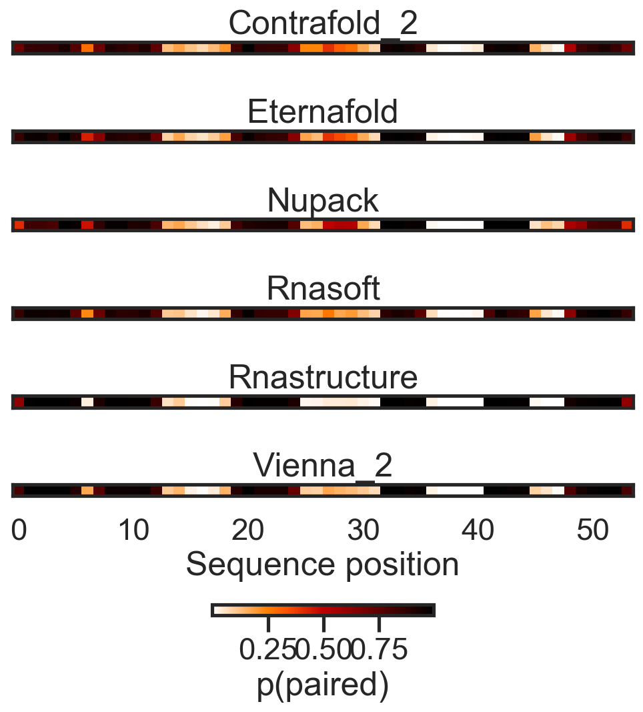

# arnie
Python API to compute RNA energetics and do structure prediction across multiple secondary structure packages.

Currently supported:

- Vienna \[1\] [https://www.tbi.univie.ac.at/RNA/#download]

- NUPACK \[2\] [http://www.nupack.org/downloads]

- RNAstructure \[3\] [https://rna.urmc.rochester.edu/RNAstructure.html]

- RNAsoft \[4\] [http://www.rnasoft.ca/download.html]

- CONTRAfold \[5\] [http://contra.stanford.edu/contrafold/]

- EternaFold \[6\] [http://https://eternagame.org/about/software]

(c) 2020 Leland Stanford Jr University

Authors:
Hannah Wayment-Steele


## Organization:

`notebooks`: example jupyter notebooks with usage.

`scripts`: scripts for processing sequences in batch.

`parameter_files`: dir of various parameter files for packages, put here out of convenience.

`test`: unit tests (still in work)

`mea`: code for computing Maximum Expected Accuracy structures.

`RNAGraph`: DEPRECATED, see https://github.com/DasLab/RiboGraphViz/ for current version of the code. Code to process and visualize secondary structures as graph objects.

## Setup:

1. To use Arnie, you will create a file that contains the paths to the software packages that Arnie is wrapping. See [`docs/setup_doc.md`](docs/setup_doc.md) for installation instructions and troubleshooting tips, as well as instructions for setting up the arnie file.

Quickstart: an example file is provided in `example_arnie_file.txt`.


2. Create a variable in your .bashrc:

```
export ARNIEFILE="/path/to/arnie/<my_file.txt>"
```

3. Add Arnie location to your python path in your .bashrc, i.e.

```
export PYTHONPATH=$PYTHONPATH:/path/to/arnie
```

## Usage:

See `notebooks/start_here.ipynb` for example syntax. In brief, comparing across packages is simple. For computing base pairing probability matrices:

```
from arnie.bpps import bpps

bpps_dict = {}
my_sequence = 'CGCUGUCUGUACUUGUAUCAGUACACUGACGAGUCCCUAAAGGACGAAACAGCG'

for pkg in ['vienna','nupack','RNAstructure','contrafold','RNAsoft']:
    bpps_dict[pkg] = bpps(my_sequence, package=pkg)
```


Can also analyze as average base pairing per nucleotide:




## References

1. Lorenz, R. et al. ViennaRNA Package 2.0. Algorithms Mol Biol 6, 26 (2011).
2. Zadeh, J.N. et al. NUPACK: Analysis and design of nucleic acid systems. J Comput Chem 32, 170-173 (2011).
3. Reuter, J.S. & Mathews, D.H. RNAstructure: software for RNA secondary structure prediction and analysis. BMC Bioinformatics 11, 129 (2010).
4. Andronescu, M., Condon, A., Hoos, H.H., Mathews, D.H. & Murphy, K.P. in RNA, Vol. 16 2304-2318 (2010).
5. Do, C.B., Woods, D.A. & Batzoglou, S. CONTRAfold: RNA secondary structure prediction without physics-based models. Bioinformatics 22, e90-98 (2006).
6. Wayment-Steele, H.K., Kladwang, W., Eterna Participants, R. Das, Biorxiv (2020).
